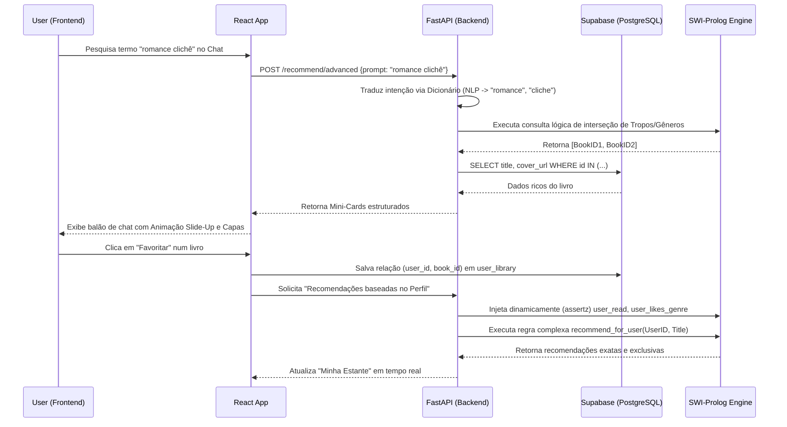

# BookMatch AI 📚✨

**BookMatch** é uma plataforma moderna e inteligente de recomendação de livros. Diferente de sistemas tradicionais baseados apenas em Machine Learning, o BookMatch utiliza um motor de inferência **Simbólico (IA Clássica)** alimentado por **Prolog**. Isso permite criar um modelo de recomendações de altíssima precisão, combinando pesos, tropos, gêneros e regras matemáticas lógicas de maneira *Explicável* (Explainable AI - XAI).

O projeto é dividido em três camadas principais:
1. **Frontend (React + Vite)**: Interface rica com animações CSS fluídas e um Chat interativo.
2. **Backend (Python + FastAPI)**: API escalável que atua como ponte, traduzindo intenções (NLP) e gerenciando a sessão.
3. **Engine Lógica (SWI-Prolog)**: O cérebro do sistema, onde fatos dinâmicos e regras de filtragem baseadas em grafos e interseção de conjuntos ocorrem.
4. **Persistência (Supabase)**: Banco de dados PostgreSQL para persistência de catálogos e perfis.

---

## 🏗️ Arquitetura e Fluxo do Sistema (UML)

O fluxo principal da aplicação baseia-se na retroalimentação de fatos dinâmicos. Quando um usuário favoritar um livro no Frontend, o Backend injeta esse dado no Motor Prolog (SWI) em tempo real, recalculando toda a árvore de recomendações.



---

## 🚀 Funcionalidades Principais

- **Intelligent Scoring (Prolog):** Avalia a similaridade entre livros calculando distâncias semânticas baseadas em Gêneros (peso alto) e Tropos (peso médio).
- **Tradução de Intenção (Chat):** O bot interpreta inputs naturais, traduzindo gírias e jargões literários brasileiros ("enemies to lovers", "romance clichê") para tags exatas do banco de dados em inglês, para garantir consultas precisas no Prolog.
- **Explainable AI (XAI):** Diferente de redes neurais, o Prolog sabe exatamente *por que* recomendou algo e expõe a trilha lógica caso requisitado.
- **Catálogo Híbrido:** Usa a **Open Library API** para enriquecer a base de dados em tempo real, permitindo aos curadores adicionarem livros ao Prolog instantaneamente.

## 📁 Estrutura do Repositório

```bash
prolog-bookmatch/
├── bookmatch/
│   ├── frontend/         # Aplicação React + Vite (Typescript)
│   ├── backend-api/      # API FastAPI (Python 3) e Módulos de Tradução NLP
│   └── backend-prolog/   # Fatos e Regras em SWI-Prolog (.pl)
└── README.md             # Este arquivo
```

> **Nota:** Para documentações específicas de como configurar as variáveis de ambiente, dependências (requirements.txt, package.json) ou rotas HTTP, consulte os arquivos `README.md` de cada subdiretório.

---
*Construído com Inteligência Simbólica e Design Vibrante.* 🔮
